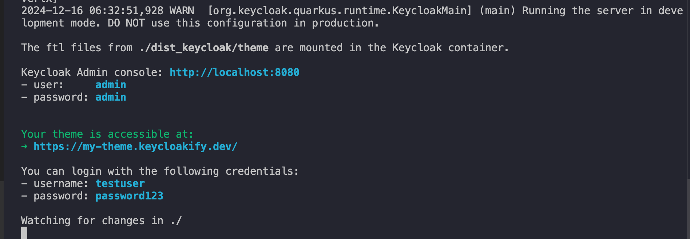
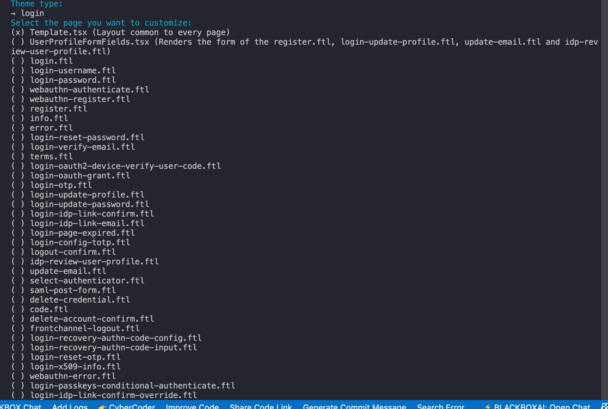

## Keycloakify for keycloak 26.x.x

### Project Installation:

    Step 1:
    $ Pull the repo 

    Step 2:  install packages 
    $ yarn install 

    Step 3: install maven ( for mac ) - it requires for server
    $ brew install mvn

    Step 4: Start the server with this keycloakify
    $ npx keycloakify start-keycloak

    in console:
    choose keycloak version ( 26.x.x )

    Output :
  

    Step 5: Test and Build
    $ npx keycloakify build

### Install Page:

You need a page to be customized you need to pull the page the the following command :

    $ npx keycloakify eject-page

Output:
 

Adding Story:
npx keycloakify add-story

Account theme init || choose single page for v3 
npx keycloakify initialize-account-theme

